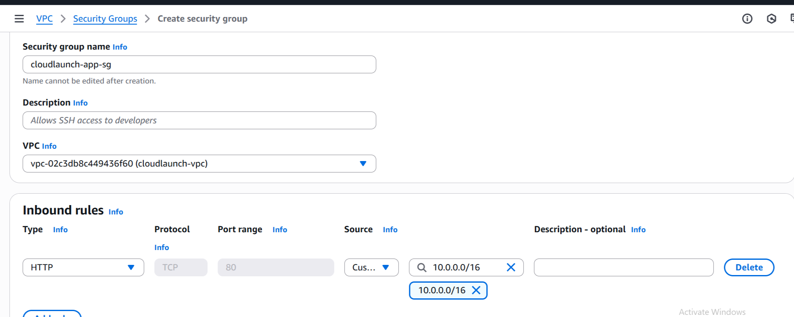

# CloudLaunch – AltSchool Cloud Engineering Assessment

**Student:** Ogbuinya Johnmark Chisom  
**AltSchool ID:** ALT/SOE/024/1754

## 📌 Overview
This project is my solution to the AltSchool Cloud Engineering Semester 3, Month 1 assessment.  
The goal was to deploy a lightweight product called **CloudLaunch**, consisting of a static company website and private internal storage.  
The implementation covered **AWS S3, IAM, and VPC fundamentals**.

---

## 🚀 Step 1: Hosting Static Website on S3
1. I created a bucket named **`cloudlaunch-site-chisom-20250823`**.
   - Enabled **Static Website Hosting**.
     
   - Uploaded `index.html` (home page) and `error.html` (fallback page).
   - Granted public read access using a bucket policy.
      
   - Verified website access via the provided **S3 website endpoint**.
      

   ✅ Static website was confirmed working by visiting the URL and seeing `index.html`.

2. I created another bucket **`cloudlaunch-private-chisom-20250823`**.
   - Not publicly accessible.
   - Only my IAM user could upload (`PutObject`) and read (`GetObject`) files.
   - Delete permission was **intentionally restricted**.

3. I also created **`cloudlaunch-visible-only-chisom-20250823`**.
   - Configured so my IAM user can only **list bucket contents**.
   - No read/write access to objects.
     

---

## 🔑 Step 2: Configuring IAM
- Created IAM user **`cloudlaunch-user`**.
- Attached an **inline JSON policy** with the following permissions:
  - List all three buckets.
  - Read & upload to the private bucket.
  - Only list in the visible-only bucket.
  - Read objects from the site bucket.
    

This ensures **principle of least privilege**.

---

## 🌐 Step 3: Building the VPC
1. Created a new VPC **`cloudlaunch-vpc`** with CIDR block `10.0.0.0/16`.
2. Added **3 subnets**:
   - Public Subnet: `10.0.1.0/24`
   - Application Subnet: `10.0.2.0/24`
   - Database Subnet: `10.0.3.0/28`
     
3. Created and attached an **Internet Gateway** (`cloudlaunch-igw`) to the VPC.
    
4. Set up **Route Tables**:
   - Public route table routes `0.0.0.0/0` to the IGW.
      
   - Application and Database route tables are private (no internet access).
5. Configured **Security Groups**:
   - App SG: allows HTTP traffic within the VPC.
      
      
   - DB SG: allows MySQL (3306) traffic only from the App Subnet.
      
      

---

## ✅ How I Verified My Work
- Opened the **S3 website URL** → confirmed that `index.html` loaded successfully.
- Tested invalid URL → confirmed `error.html` showed.
  
- Used the **IAM user credentials** to:
  - Upload and read files in the private bucket.
     
  - List objects in the visible-only bucket.
- Verified that the **VPC, subnets, and route tables** were properly created under **VPC → Your VPCs** in the AWS Console.

---

## 📖 Lessons Learned
- How to securely host a **static website** on AWS S3.
- How to apply **IAM policies** with least privilege.
- Fundamentals of **VPC networking**: subnets, route tables, gateways, and security groups.
- How to troubleshoot common issues like wrong region selection, missing root objects (`index.html`), and IAM permission errors.

---

## 🌍 Deliverables
- **Website Bucket:** `cloudlaunch-site-chisom-20250823`
- **Private Bucket:** `cloudlaunch-private-chisom-20250823`
- **List-Only Bucket:** `cloudlaunch-visible-only-chisom-20250823`
- **IAM User:** `cloudlaunch-user`
- **VPC:** `cloudlaunch-vpc` with 3 subnets, 1 IGW, and 3 route tables

